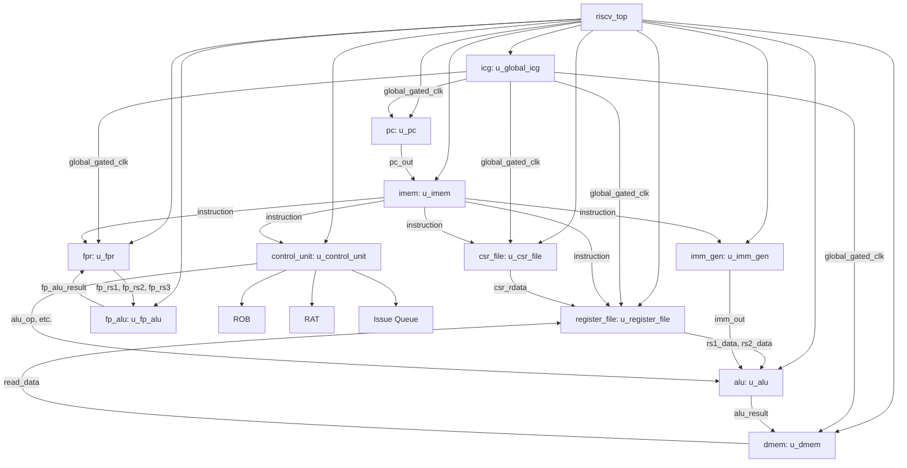

# Digital Block RTL Documentation

## 1. Block Name

**Block Name**: riscv_top
**File**: riscv_top.v
**Version**: v3.0
**Author**: Sagi
**Date**: 2026-05-20

## 2. High-Level Functionality

The `riscv_top` module implements a 5-stage pipelined, Out-of-Order (OoO) RISC-V processor supporting the RV32IMAFD instruction set architecture (ISA) along with Privileged mode operations (M-mode). 

Key features include:
- **RV32IMAFD Support**: Base integer instructions (I), Integer Multiplication and Division (M), Atomic Instructions (A), Single-Precision Floating-Point (F), and Double-Precision Floating-Point (D).
- **5-Stage Pipeline & OoO Execution**: Features a Reorder Buffer (ROB), Register Alias Table (RAT), and Issue Queue. OoO execution is controlled via CSR 0x7C0 (default disabled).
- **IEEE 754 FPU**: Floating-point unit with NaN-boxing handled in the execution units and memory load stage, not in the register file.
- **Privileged Architecture**: Supports Machine-level privileges (M-mode), exceptions, and CSR manipulation.
- **Clock Gating**: Integrated auto-clock gating via an Integrated Clock Gating (ICG) cell and fine-grained clock gating to reduce dynamic power consumption.

## 3. Hierarchical Block Diagram

## 4. RTL Interfaces and Signals
*(Omitted for brevity, identical to base RV32IMAFD with added pipeline control signals)*

## 5. Clocks and Reset
*(Omitted for brevity)*

## 6. Memory Description
*(Omitted for brevity)*

## 7. Datapath and Control

### 7.1 Datapath Flow
- **Instruction Fetch (IF)**: PC supplies address to IMEM.
- **Instruction Decode (ID) / Issue**: Instruction fields are sent to Control Unit, Integer RF, FPR, and Imm Gen. Instructions are dispatched to the Issue Queue, RAT renames registers, and ROB allocates entries.
- **Execute (EX)**: 
  - Integer ALU computes results.
  - FP ALU computes floating-point operations (NaN-boxing applied here).
- **Memory Access (MEM)**: DMEM is accessed. NaN-boxing applied to FP loads.
- **Write-Back (WB) / Commit**: Results are committed in-order via the ROB to the Integer RF or FPR.

### 7.2 Control Signals
- `csr_0x7C0`: Controls Out-of-Order execution enable/disable.
- Pipelined control signals (e.g., pipelined `fmt`, `alu_op`).

## 8. Instruction Formats and Supported Instructions
*(Omitted for brevity)*