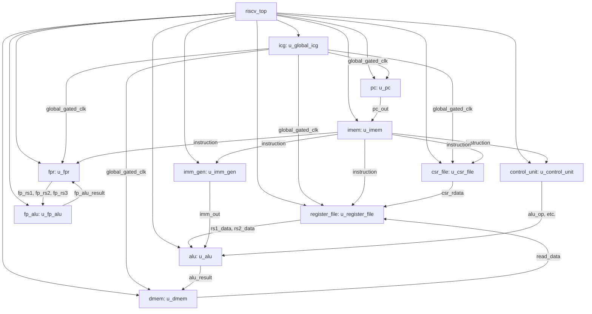

# Digital Block RTL Documentation

## 1. Block Name

**Block Name**: riscv_top
**File**: riscv_top.v
**Version**: v2.0
**Author**: Sagi
**Date**: 2026-05-14

## Table of Contents

| Section | Description |
|---------|-------------|
| [1. Block Name](#1-block-name) | Module identification and versioning |
| [2. High-Level Functionality](#2-high-level-functionality) | Purpose and key features |
| [3. Hierarchical Block Diagram](#3-hierarchical-block-diagram) | Architecture and sub-modules |
| [4. RTL Interfaces and Signals](#4-rtl-interfaces-and-signals) | Signal descriptions and tables |
| [5. Clocks and Reset](#5-clocks-and-reset) | Clock domains and reset signals |
| [6. Memory Description](#6-memory-description) | IMEM and DMEM details |
| [7. Datapath and Control](#7-datapath-and-control) | Mathematical Datapath / Control Signals |
| [8. Instruction Formats and Supported Instructions](#8-instruction-formats-and-supported-instructions) | Based on control_unit.v |

---
[↑ Back to Table of Contents](#table-of-contents)

## 2. High-Level Functionality

The `riscv_top` module implements a single-cycle RISC-V processor supporting the RV32IMAFD instruction set architecture (ISA) along with Privileged mode operations. It integrates the Program Counter (PC), Instruction Memory (IMEM), Integer Register File, Immediate Generator, Integer ALU, Control Unit, Data Memory (DMEM), Control and Status Register (CSR) File, Floating-Point Register File (FPR), and Floating-Point ALU (FP ALU). 

Key features include:
- **RV32IMAFD Support**: Base integer instructions (I), Integer Multiplication and Division (M), Atomic Instructions (A), Single-Precision Floating-Point (F), and Double-Precision Floating-Point (D).
- **Privileged Architecture**: Supports Machine-level privileges, exceptions, and CSR manipulation.
- **Clock Gating**: Integrated auto-clock gating via an Integrated Clock Gating (ICG) cell to reduce dynamic power consumption.
- **Parameterization**: Extensions (M, A, F, D) and Privileged mode can be enabled or disabled via module parameters.

---
[↑ Back to Table of Contents](#table-of-contents)

## 3. Hierarchical Block Diagram

---
[↑ Back to Table of Contents](#table-of-contents)

## 4. RTL Interfaces and Signals

### 4.1 Top-Level Interface (`riscv_top`)
| Signal Name | Direction | Width | Description |
|-------------|-----------|-------|-------------|
| clk | Input | 1 | System clock |
| clk_en | Input | 1 | Global clock enable for clock gating |
| rst_n | Input | 1 | Active-low synchronous reset |

### 4.2 Parameters
| Parameter Name | Default | Description |
|----------------|---------|-------------|
| PRIVILEGED | 1 | Enables Privileged architecture and CSRs |
| EXTENSION_M | 1 | Enables Integer Multiplication/Division |
| EXTENSION_A | 1 | Enables Atomic Instructions |
| EXTENSION_F | 1 | Enables Single-Precision Floating-Point |
| EXTENSION_D | 1 | Enables Double-Precision Floating-Point |

### 4.3 Key Sub-Module Interfaces

#### PC (`pc.v`)
| Signal Name | Direction | Width | Description |
|-------------|-----------|-------|-------------|
| pc_sel | Input | 1 | PC source select: 0=PC+4, 1=pc_target |
| pc_target | Input | 32 | Branch/jump target address |
| exception | Input | 1 | Exception trigger signal |
| mtvec | Input | 32 | Machine trap-vector base-address |
| mret_exec | Input | 1 | MRET instruction execution flag |
| mepc | Input | 32 | Machine exception program counter |
| pc_out | Output | 32 | Current program counter value |

#### Register File (`register_file.v`)
| Signal Name | Direction | Width | Description |
|-------------|-----------|-------|-------------|
| we | Input | 1 | Write enable |
| rs1_addr | Input | 5 | Read port 1 address |
| rs2_addr | Input | 5 | Read port 2 address |
| rd_addr | Input | 5 | Write port address |
| rd_data | Input | 32 | Write data |
| rs1_data | Output | 32 | Read port 1 data |
| rs2_data | Output | 32 | Read port 2 data |

#### CSR File (`csr_file.v`)
| Signal Name | Direction | Width | Description |
|-------------|-----------|-------|-------------|
| csr_addr | Input | 12 | CSR address |
| csr_wdata | Input | 32 | CSR write data |
| csr_op | Input | 2 | CSR operation (RW, RS, RC) |
| csr_write | Input | 1 | CSR write enable |
| exception | Input | 1 | Exception trigger |
| csr_rdata | Output | 32 | CSR read data |

#### Floating-Point Register File (`fpr.v`)
| Signal Name | Direction | Width | Description |
|-------------|-----------|-------|-------------|
| we | Input | 1 | FP Write enable |
| rd_addr | Input | 5 | FP Write port address |
| rs1_addr | Input | 5 | FP Read port 1 address |
| rs2_addr | Input | 5 | FP Read port 2 address |
| rs3_addr | Input | 5 | FP Read port 3 address |
| write_data | Input | FLEN | FP Write data |
| rs1_data | Output | FLEN | FP Read port 1 data |

---
[↑ Back to Table of Contents](#table-of-contents)

## 5. Clocks and Reset

### 5.1 Clock Domains
| Clock Name | Frequency | Source | Function |
|------------|-----------|---------|----------|
| clk | System | External | Main system clock |
| global_gated_clk | System | ICG | Gated clock used for PC, Register File, DMEM, CSR, and FPR. Enabled by `clk_en`. |

### 5.2 Reset Signals
| Reset Name | Type | Polarity | Scope | Description |
|------------|------|----------|--------|-------------|
| rst_n | Synchronous | Active Low | Global | Resets PC to 0x0000_0000 and clears all state elements (RF, CSR, FPR) |

---
[↑ Back to Table of Contents](#table-of-contents)

## 6. Memory Description

### 6.1 Instruction Memory (IMEM)
- **Type**: Read-Only Memory (ROM)
- **Access**: Combinational (asynchronous) read
- **Function**: Stores the program instructions. Addressed by `pc_out`.

### 6.2 Data Memory (DMEM)
- **Type**: Random Access Memory (RAM)
- **Size**: Configurable, data width depends on `EXTENSION_D` (64-bit if enabled, else 32-bit).
- **Access**: Synchronous write (on `posedge global_gated_clk`), combinational read
- **Features**: Byte-addressable, little-endian. Supports byte, halfword, word, and doubleword accesses. Supports Atomic Memory Operations (AMOs).

---
[↑ Back to Table of Contents](#table-of-contents)

## 7. Datapath and Control

### 7.1 Datapath Flow
- **Instruction Fetch**: PC supplies address to IMEM. PC is updated to PC+4, branch/jump target, or exception/return target.
- **Decode/Register Read**: Instruction fields are sent to Control Unit, Integer RF, FPR, and Imm Gen.
- **Execute**: 
  - Integer ALU computes results based on `operand_a` and `operand_b`.
  - FP ALU computes floating-point operations.
  - Branch target is computed using a separate adder.
- **Memory Access**: DMEM is accessed using `alu_result` as the address. Handles both integer and FP loads/stores, as well as AMOs.
- **Write-Back**: Result from ALU, DMEM, PC+4, CSR, or FP ALU is written back to the Integer RF or FPR.

### 7.2 Control Signals
- `reg_write` / `fp_we`: Enables writing to the Integer RF / FPR.
- `result_sel`: Selects integer write-back data (00=ALU, 01=DMEM, 10=PC+4, 11=CSR).
- `mem_write` / `mem_read`: Enables DMEM write/read.
- `amo_en` / `amo_op`: Controls Atomic Memory Operations.
- `csr_write` / `csr_op`: Controls CSR reads/writes.
- `exception` / `mret_exec`: Controls exception handling and returns.
- `fp_alu_op` / `fmt` / `rm`: Controls Floating-Point ALU operations, format (Single/Double), and rounding mode.

---
[↑ Back to Table of Contents](#table-of-contents)

## 8. Instruction Formats and Supported Instructions

### 8.1 Supported Instructions
Based on the RV32IMAFD ISA and Privileged architecture:
- **RV32I (Base)**: ADD, SUB, SLL, SLT, SLTU, XOR, SRL, SRA, OR, AND, ADDI, SLLI, SLTI, SLTIU, XORI, SRLI, SRAI, ORI, ANDI, LB, LH, LW, LBU, LHU, SB, SH, SW, BEQ, BNE, BLT, BGE, BLTU, BGEU, JAL, JALR, LUI, AUIPC.
- **RV32M (Multiply/Divide)**: MUL, MULH, MULHSU, MULHU, DIV, DIVU, REM, REMU.
- **RV32A (Atomics)**: LR.W, SC.W, AMOSWAP.W, AMOADD.W, AMOXOR.W, AMOAND.W, AMOOR.W, AMOMIN.W, AMOMAX.W, AMOMINU.W, AMOMAXU.W.
- **RV32F/D (Floating-Point)**: FLW, FLD, FSW, FSD, FADD, FSUB, FMUL, FDIV, FSQRT, FMADD, FMSUB, FNMSUB, FNMADD, FMIN, FMAX, FCVT, FMV, FEQ, FLT, FLE, FCLASS.
- **Privileged / System**: CSRRW, CSRRS, CSRRC, CSRRWI, CSRRSI, CSRRCI, ECALL, EBREAK, MRET.

### 8.2 Instruction Formats
- **R-Type**: `opcode` (7), `rd` (5), `funct3` (3), `rs1` (5), `rs2` (5), `funct7` (7)
- **I-Type**: `opcode` (7), `rd` (5), `funct3` (3), `rs1` (5), `imm[11:0]` (12)
- **S-Type**: `opcode` (7), `imm[4:0]` (5), `funct3` (3), `rs1` (5), `rs2` (5), `imm[11:5]` (7)
- **B-Type**: `opcode` (7), `imm[11,4:0]` (6), `funct3` (3), `rs1` (5), `rs2` (5), `imm[12,10:5]` (7)
- **U-Type**: `opcode` (7), `rd` (5), `imm[31:12]` (20)
- **J-Type**: `opcode` (7), `rd` (5), `imm[20,10:1,11,19:12]` (20)
- **R4-Type (FP)**: `opcode` (7), `rd` (5), `funct3` (3), `rs1` (5), `rs2` (5), `funct2` (2), `rs3` (5)

---
[↑ Back to Table of Contents](#table-of-contents)
